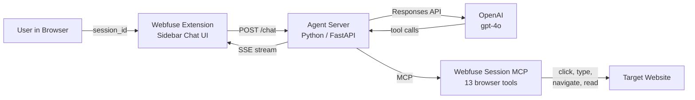

# OpenAI Agents SDK + Webfuse MCP

An AI agent that controls a live browser. Built with the [OpenAI Agents SDK](https://platform.openai.com/docs/api-reference/responses) and [Webfuse Session MCP](https://dev.webfu.se/session-mcp-server/).

**Live demo:** [webfu.se/+openai-agent/](https://webfu.se/+openai-agent/)

## What It Does

A chat interface in a Webfuse extension sidebar. Type a message or click an example chip, and the AI agent reads the page, reasons about it, and takes actions: clicking links, scrolling, extracting data, filling forms. You watch every step happen live in your browser.

## Architecture



The extension sends the session ID to the agent server. The server holds both API keys (OpenAI + Webfuse), runs the agent, and streams results back as SSE events. No API keys in the extension.

## Prerequisites

- Python 3.10+
- An [OpenAI](https://platform.openai.com) API key
- A [Webfuse](https://webfuse.com) account with a Space
- The Automation App installed on your Space

## Quick Start

```bash
cd agent
pip install fastapi uvicorn httpx openai
cp .env.example .env          # Add your keys
uvicorn agent:app --port 8080
```

Deploy the `demo-extension/` folder as a Webfuse extension on your Space. Set the `AGENT_URL` env var to your server URL.

## Configuration

| Variable | Description | Where to get it |
|----------|-------------|----------------|
| `OPENAI_API_KEY` | OpenAI API key | [platform.openai.com](https://platform.openai.com) |
| `WEBFUSE_REST_KEY` | Space REST API key (`rk_...`) | Webfuse dashboard > Space > API Keys |
| `AGENT_URL` | Agent server URL (extension env) | Your server URL or Cloudflare tunnel |

## How It Works

The agent uses OpenAI's Responses API with Webfuse MCP tools. Each user message triggers a chain of tool calls: the agent reads the page via `see_domSnapshot`, reasons about what to do, then acts via `act_click`, `act_type`, `act_scroll`, etc.

**Endpoints:**

| Endpoint | Method | Description |
|----------|--------|-------------|
| `/chat` | POST | Free-form chat. Send `{ "session_id": "...", "message": "..." }`. Returns SSE stream. |
| `/run` | POST | Guided 8-step Wikipedia demo. Send `{ "session_id": "..." }`. Returns SSE stream. |
| `/health` | GET | Returns `{ "status": "ok" }` |

**MCP Tools available:** All 13 Webfuse Session MCP tools (navigate, 4x see, 7x act, wait). Target elements via Webfuse IDs, CSS selectors, or `[x,y]` coordinates.

**Files:**

```
demo-extension/        Webfuse extension (sidebar UI)
agent/                 Python agent server (FastAPI)
agent/worker/          Cloudflare Worker (optional CORS proxy)
```

## Links

- [Webfuse](https://webfuse.com)
- [Session MCP Server docs](https://dev.webfu.se/session-mcp-server/)
- [OpenAI Agents SDK](https://platform.openai.com/docs/api-reference/responses)

## Other Webfuse Integrations

- [LangChain / LangGraph](https://github.com/webfuse-com/extension-langchain-mcp) - Multi-page research agent
- [Vercel AI SDK](https://github.com/webfuse-com/extension-vercel-ai-mcp) - Next.js browsing assistant
- [LiveKit Voice Agent](https://github.com/webfuse-com/extension-livekit-mcp) - Voice-controlled browser
- [ChatGPT GPT](https://github.com/webfuse-com/chatgpt-webfuse-mcp) - Custom GPT with browser tools

## License

MIT
